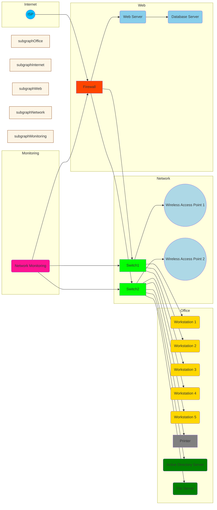

```mermaid
graph LR

style subgraphOffice fill:#FDF5E6,stroke:#8B4513,stroke-width:1px
subgraph Office
  WS1(Workstation 1)
  WS2(Workstation 2)
  WS3(Workstation 3)
  WS4(Workstation 4)
  WS5(Workstation 5)
  Printer
  AD(Active Directory Server)
  FS(File Server)
  style WS1 fill:#FFD700
  style WS2 fill:#FFD700
  style WS3 fill:#FFD700
  style WS4 fill:#FFD700
  style WS5 fill:#FFD700
  style Printer fill:#808080
  style AD fill:#008000
  style FS fill:#008000
end

style subgraphInternet fill:#FDF5E6,stroke:#8B4513,stroke-width:1px
subgraph Internet
  ISP((ISP))
  style ISP fill:#00BFFF
end

style subgraphWeb fill:#FDF5E6,stroke:#8B4513,stroke-width:1px
subgraph Web
  Firewall
  WebServer(Web Server)
  DB(Database Server)
  style Firewall fill:#FF4500
  style WebServer fill:#87CEEB
  style DB fill:#87CEEB
end

style subgraphNetwork fill:#FDF5E6,stroke:#8B4513,stroke-width:1px
subgraph Network
  Switch1
  Switch2
  WAP1((Wireless Access Point 1))
  WAP2((Wireless Access Point 2))
  style Switch1 fill:#00FF00
  style Switch2 fill:#00FF00
  style WAP1 fill:#ADD8E6
  style WAP2 fill:#ADD8E6
end

style subgraphMonitoring fill:#FDF5E6,stroke:#8B4513,stroke-width:1px
subgraph Monitoring
  NMS(Network Monitoring)
  style NMS fill:#FF1493
end

ISP --> Firewall
Firewall --> WebServer
WebServer --> DB
Firewall --> Switch1
Firewall --> Switch2
Switch1 --> WS1
Switch1 --> WS2
Switch1 --> WS3
Switch2 --> WS4
Switch2 --> WS5
Switch2 --> Printer
Switch2 --> AD
Switch2 --> FS
Switch1 --> WAP1
Switch2 --> WAP2
NMS --> Switch1
NMS --> Switch2
NMS --> Firewall
```
