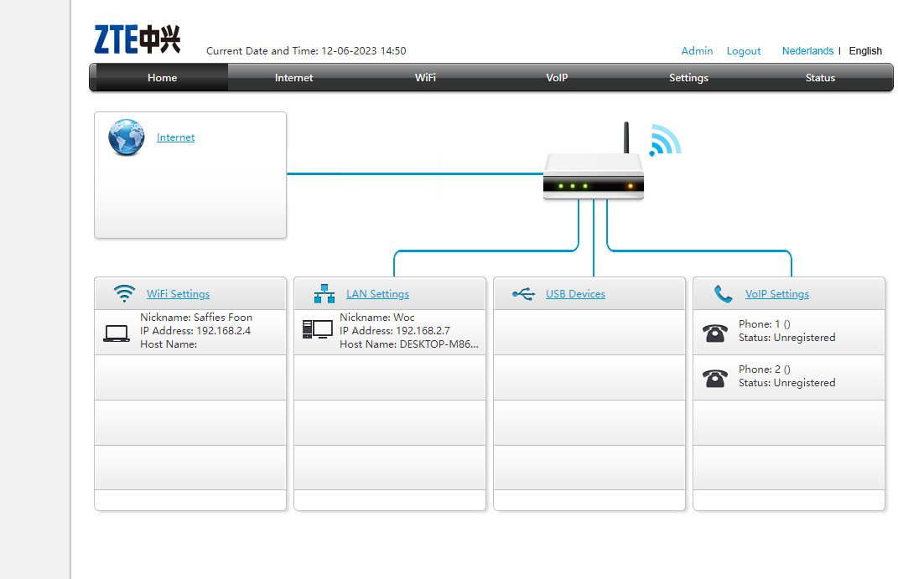
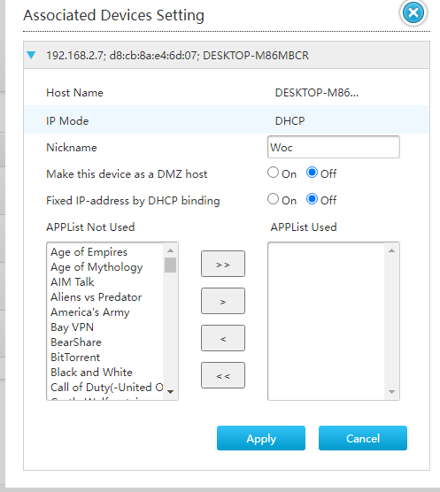
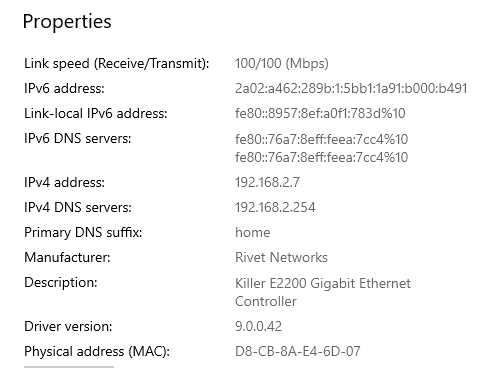
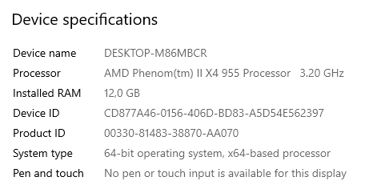

# Network devices

## Key-terms
**DHCP**

## Opdracht
### Gebruikte bronnen
<https://www.192-168-1-1-ip.co/router/zte/h369a/9292/>-----> Informatie over het enteren van mijn router. 

### Ervaren problemen
De verbinding met mijn router blijkt "not secure" te zijn. Dit blijkt uit een melding van Google Chrome.

### Resultaat
2. Via mijn browser heb ik een overzicht van alle apparaten kunnen verkrijgen. Ik ging in mijn browser naar "http://192.168.2.254/". Daar ben ik ingelogd via het Admin-account, waarvoor geen wachtwoord nodig was. Daarna kreeg ik het volgende overzicht te zien: Uit dit overicht blijkt dat er 2 apparaten verbonden zijn met mijn router. Dit zijn namelijk mijn telefoon en mijn desktop.   
3. Bij deze opdracht proberen we te achterhalen over wat voor informatie de router beschikt m.b.t. de aangesloten apparatuur. Klik ik op een apparaat in het onderhavige overzicht, dan zie ik dit:   
We zien in het plaatje onder "Associated Devices Setting" drie kenmerken staan, gescheiden door een puntkomma. Het eerste kenmerk is het IP-adres van het apparaat in kwestie. Het tweede kenmerk is Het MAC-adres, oftewel het fysieke adres. Het derde kenmerk bereft de naam van het geconnecteerde apparaat. Aangezien het apparaat in kwestie mijn desktop betreft, kon ik via de properties daarin de voorgaande kenmerken thuisbrengen. Als ik namelijk naar de properties van mijn verbinding keek, zag ik het volgende:  
  
Verder kon ik de naam van mijn desktop zien bij de algemene settings van mijn pc. Voor de volledigheid kan dat met eigen ogen aanschouwt worden d.m.v. dit knipsel:
4. 
