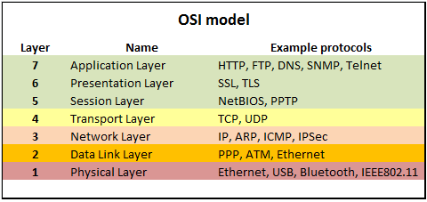
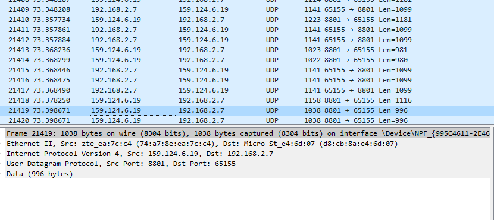

# Protocols

## Key-terms
**TCP**  
TCP staat voor Transmission Control Protocol en is een betrouwbaar en verbindingsgeoriënteerd protocol dat verantwoordelijk is voor het segmenteren, verzenden en ontvangen van gegevenspakketten tussen bron- en doelhosts op een netwerk. Het wordt gebruikt in laag 4 van het Stack model.   
**UDP**  
UDP staat voor User Datagram Protocol en is een onbetrouwbaar en verbindingsloos protocol dat wordt gebruikt voor het verzenden van gegevenspakketten over een netwerk, waarbij snelheid en minimale overhead belangrijker zijn dan betrouwbaarheid. Dit protocol wordt gebruikt in laag 4 van het OSI-stack model. 

**SMTP**  
SMTP staat voor Simple Mail Transfer Protocol en is een protocol dat wordt gebruikt voor het verzenden van e-mailberichten over een netwerk.

## Opdracht
### Gebruikte bronnen
<https://infosys.beckhoff.com/english.php?content=../content/1033/tf6310_tc3_tcpip/84246923.html&id=>-----> OSI layers i.v.m. protocols.  
<https://int0x33.medium.com/day-51-understanding-the-osi-model-f22d5f3df756>-----> OSI layers i.v.m. protocols.  
<https://www.certblaster.com/network-plus-n10-007-sub-objective-1-2-explain-devices-applications-protocols-and-services-at-their-appropriate-osi-layers/>----->OSI layers i.v.m. protocols.

### Ervaren problemen
Effectief onthouden welke protocol in welke layer hoort. 
### Resultaat
1. Hieronder een overzicht van de layers van het OSI model, waarbij  voor elke layer geliereerde protocols worden genoemd:  
   
Zie voor de herkomst van dit plaatje de eerstvermelde link onder het kopje "Gebruikte bronnen".  
2. 

3.  Zie hieronder een screenshot van Wireshark:  
  
In de interface van Wireshark heb ik fram 21419 geselecteerd. 