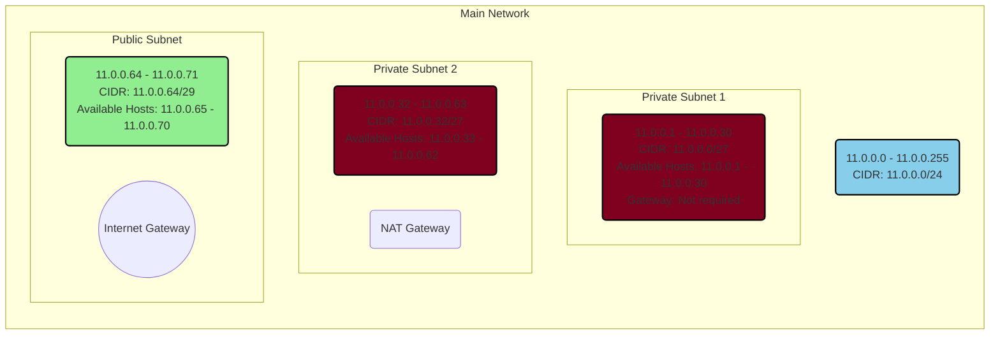
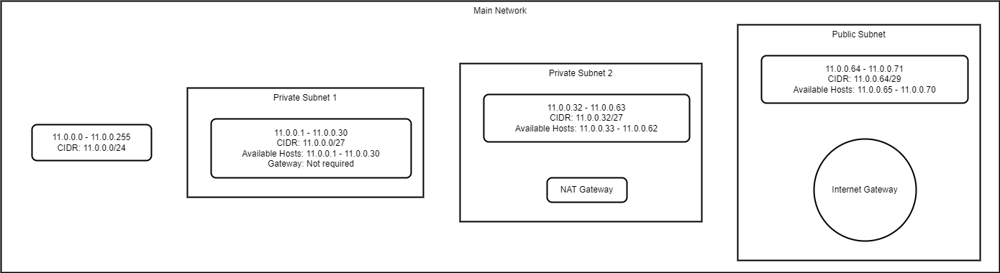

# Subnetten

## Key-terms
[Schrijf hier een lijst met belangrijke termen met eventueel een korte uitleg.]

## Opdracht
### Gebruikte bronnen
<https://tech-lib.nl/subnetmasker/>  
<https://www.cisco.com/c/nl_nl/support/docs/ip/routing-information-protocol-rip/13788-3.html>  
<https://dnsmadeeasy.com/support/subnet>----->ezelsbrug voor subnet-masken. 

### Resultaat
Voor de netwerkarchitectuur kunnen we uitgaan van het schema hieronder: 

*Uitleg van getekende schema*  
Voor de totale opdracht zijn 62 private hosts nodig. De subnet mask van de hoordverbinding kan dus als volgt worden weergeven: 0.0.0.0/24. De hoofdverbinding heb ik voor de vlotte afhandeling van deze opdracht zélf vastgesteld en wel op 11.0.0.0/24. Aan de hand van het schema valt vast te stellen hoe de IP-adressen verder verdeeld zijn. Ik heb nog een afbeelding gegenereerd met behulp van de applicatie van diagrams.net. Deze afbeelding zal ik hieronder posten ter afsluiting van deze opdracht en om hopelijk de gebruikte architectuur nog duidelijker te krijgen:  

