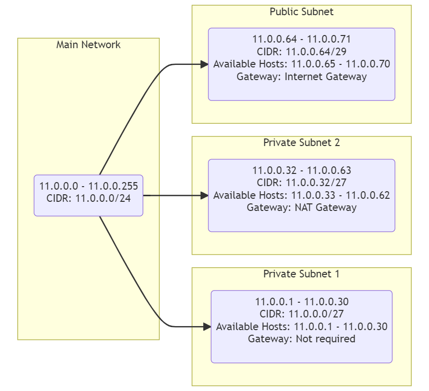

# [Subnetten]
[Geef een korte beschrijving van het onderwerp]

## Key-terms
[Schrijf hier een lijst met belangrijke termen met eventueel een korte uitleg.]

## Opdracht
### Gebruikte bronnen
<https://tech-lib.nl/subnetmasker/>  
<https://www.cisco.com/c/nl_nl/support/docs/ip/routing-information-protocol-rip/13788-3.html>
<https://dnsmadeeasy.com/support/subnet>----->ezelsbrug voor subnet-masken. 

### Resultaat
Architectuur: 

*Uitleg van getekende schema*  
Voor de totale opdracht zijn 62 private hosts nodig. De subnet mask van de hoordverbinding kan dus als volgt worden weergeven: 0.0.0.0/24. De hoofdverbinding heb ik voor de vlotte afhandeling van deze opdracht zélf vastgesteld en wel op 11.0.0.0/24.
