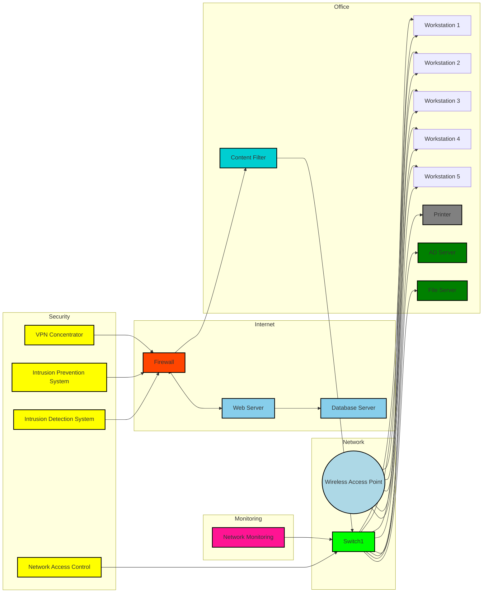

```mermaid
graph LR

subgraph Internet
  Firewall
  WebServer[Web Server]
  DB[Database Server]
end

subgraph Office
  CF[Content Filter]
  WS1["Workstation 1"]
  WS2["Workstation 2"]
  WS3["Workstation 3"]
  WS4["Workstation 4"]
  WS5["Workstation 5"]
  Printer
  AD[AD Server]
  FS[File Server]
end

subgraph Network
  Switch1
  WAP((Wireless Access Point))
end

subgraph Security
  IDS[Intrusion Detection System]
  IPS[Intrusion Prevention System]
  VPN[VPN Concentrator]
  NAC[Network Access Control]
end

subgraph Monitoring
  NMS[Network Monitoring]
end

Internet --> Firewall
Firewall --> WebServer
WebServer --> DB
Firewall --> CF
CF --> Switch1
Switch1 --> WS1
Switch1 --> WS2
Switch1 --> WS3
Switch1 --> WS4
Switch1 --> WS5
Switch1 --> Printer
Switch1 --> AD
Switch1 --> FS
WAP --> WS1
WAP --> WS2
WAP --> WS3
WAP --> WS4
WAP --> WS5
IDS --> Firewall
IPS --> Firewall
VPN --> Firewall
NAC --> Switch1
NMS --> Switch1

style WebServer fill:#87CEEB,stroke:#000000,stroke-width:2px
style DB fill:#87CEEB,stroke:#000000,stroke-width:2px
style FS fill:#008000,stroke:#000000,stroke-width:2px
style AD fill:#008000,stroke:#000000,stroke-width:2px
style Printer fill:#808080,stroke:#000000,stroke-width:2px
style WAP fill:#ADD8E6,stroke:#000000,stroke-width:2px
style Firewall fill:#FF4500,stroke:#000000,stroke-width:2px
style Switch1 fill:#00FF00,stroke:#000000,stroke-width:2px
style IDS fill:#FFFF00,stroke:#000000,stroke-width:2px
style IPS fill:#FFFF00,stroke:#000000,stroke-width:2px
style VPN fill:#FFFF00,stroke:#000000,stroke-width:2px
style NAC fill:#FFFF00,stroke:#000000,stroke-width:2px
style CF fill:#00CED1,stroke:#000000,stroke-width:2px
style NMS fill:#FF1493,stroke:#000000,stroke-width:2px
```
