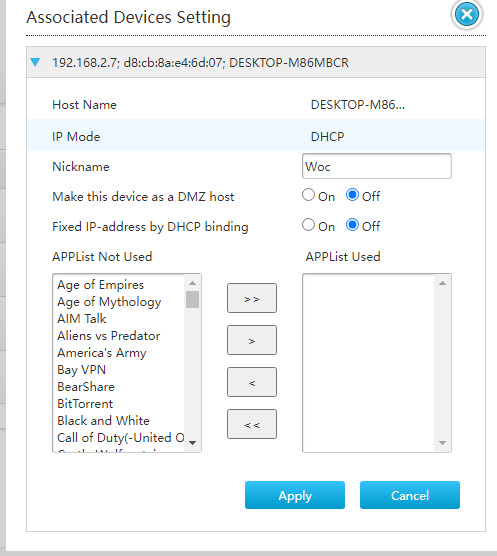
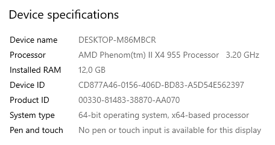
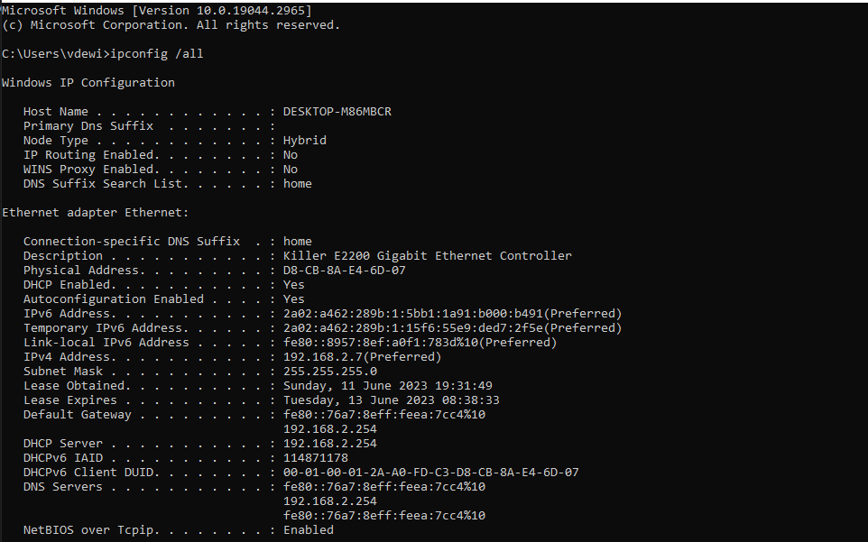

# Network Devices
Netwerkapparaten kunnen worden gezien als bouwstenen of componenten van een groter netwerk. Ze bieden de functionaliteit die nodig is om communicatie tussen verschillende apparaten mogelijk te maken. Deze apparaten werken samen om gegevens te verzenden, te ontvangen en te routeren, waardoor informatie-uitwisseling mogelijk wordt gemaakt.

## Key-terms
**DHCP**  
Deze afkorting staat voor Dynamic Host Configuration Protocol. DHCP wordt meestal gebruikt in lokale netwerken, zoals thuisnetwerken of kantoornetwerken, waar er meerdere apparaten zijn die toegang tot het netwerk nodig hebben. Het stelt netwerkbeheerders in staat om een pool van IP-adressen te definiëren en de DHCP-server wijst automatisch een beschikbaar IP-adres toe aan een apparaat wanneer het verbinding maakt met het netwerk.

## Opdracht
### Gebruikte bronnen
<https://www.192-168-1-1-ip.co/router/zte/h369a/9292/>-----> Informatie over het enteren van mijn router. 

### Ervaren problemen
De verbinding met mijn router blijkt "not secure" te zijn. Dit blijkt uit een melding van Google Chrome. Gelukkig van een studiegenoot vernomen dat dit niet een probleem gaat vormen in mijn geval.  

### Resultaat
2. Via mijn browser heb ik een overzicht van alle apparaten kunnen verkrijgen. Ik ging in mijn browser naar "http://192.168.2.254/". Daar ben ik ingelogd via het Admin-account, waarvoor geen wachtwoord nodig was. Daarna kreeg ik het volgende overzicht te zien:  
 Uit dit overicht blijkt dat er 2 apparaten verbonden zijn met mijn router. Dit zijn namelijk mijn telefoon en mijn desktop.   
3. Bij deze opdracht proberen we te achterhalen over wat voor informatie de router beschikt m.b.t. de aangesloten apparatuur. Klik ik op een apparaat in het onderhavige overzicht, dan zie ik dit:  
   
We zien in het plaatje onder "Associated Devices Setting" drie kenmerken staan, gescheiden door een puntkomma. Het eerste kenmerk is het IP-adres van het apparaat in kwestie. Het tweede kenmerk is Het MAC-adres, oftewel het fysieke adres. Het derde kenmerk bereft de naam van het geconnecteerde apparaat. Aangezien het apparaat in kwestie mijn desktop betreft, kon ik via de properties daarin de voorgaande kenmerken thuisbrengen. Als ik namelijk naar de properties van mijn verbinding keek, zag ik het volgende:  
  
Verder kon ik de naam van mijn desktop zien bij de algemene settings van mijn pc. Voor de volledigheid kan dat met eigen ogen aanschouwd worden d.m.v. dit knipsel:  

4. Op  een van de browser-paginas van mijn router kan ik het volgende zien over mijn DHCP-server van mijn netwerk:  
  
Uit het bovenstaande plaatje valt af te leiden dat de DHCP-server zich bevindt op het ip-adres 192.168.2.254. Dit wordt bevestigd als ik de command "ipconfig /all" run in het commando-interface van Windows. Daarbij zie ik namelijk dit:  

