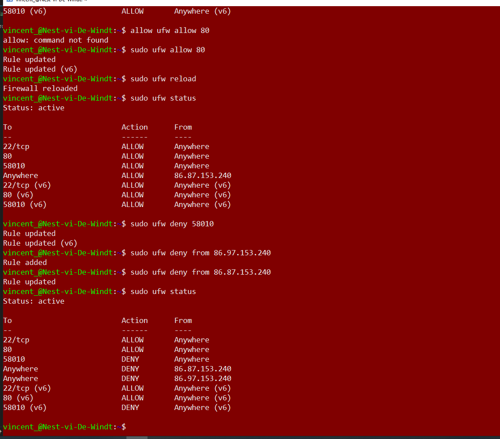
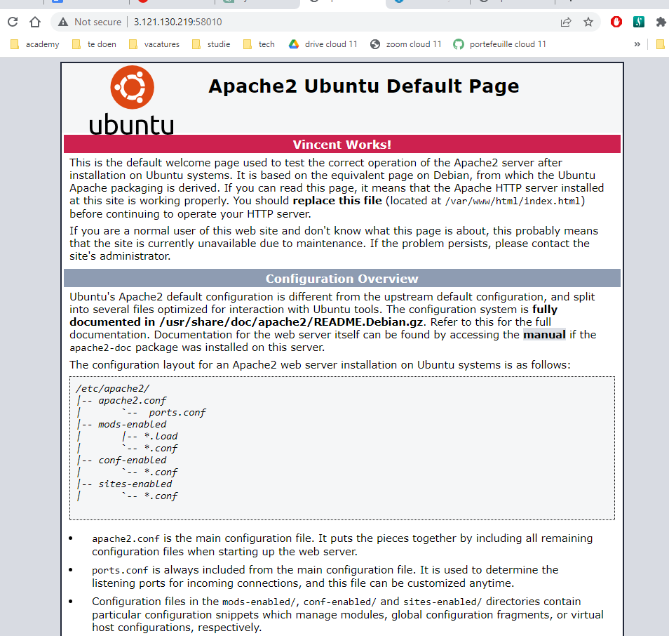

# [Firewalls]
Een firewall is een beveiligingsmechanisme dat het netwerkverkeer controleert en ongeautoriseerde toegang tot het systeem voorkomt door middel van regels. Het beschermt het systeem en het netwerk tegen kwaadaardige activiteiten.

## Opdracht
### Gebruikte bronnen

### Ervaren problemen

### Resultaat
De volgende twee screenshots demonstreren dat ik de opdracht heb uitgevoerd. 

  

