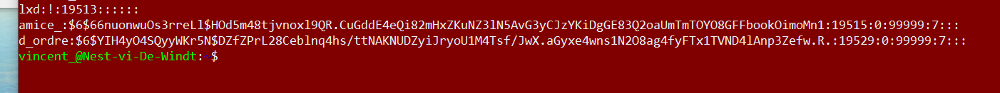

# Wachtwoorden

## Key-terms
**hashing**  
**salting** 
**rainbow table**  
**passphrases**  
**MD5**  

## Opdracht
### Gebruikte bronnen  
[Hoe werkt een rainbow table](https://geekflare.com/nl/rainbow-table-attack/)   
[Hashing uitgelegd](https://www.csoonline.com/article/3602698/hashing-explained-why-its-your-best-bet-to-protect-stored-passwords.html#:~:text=Hashing%20is%20almost%20always%20preferable,know%20the%20user's%20plaintext%20password.)  
[Wederom: hoe werkt een rainbow table](https://www.passcamp.com/blog/rainbow-tables-what-they-are-how-they-work/) 
### Ervaren problemen
Hetgene dat in de Zoomchat wordt gedeeld wordt niet automatisch opgeslagen, Hierdoor is er wat data verloren gegaan. 

### Resultaat
1. Bij het hashen van wachtwoorden worden deze via een hash-methode omgezet in een bepaalde cryptografische code. Deze code is niet terug te leiden naar het oorspronkelijke wachtwoord. Bij  encryptie kan dit laatste wel gebeuren, mits men ook de sleutel heeft waarmee er versleuteld is. Dit maakt dat het hashen van wachtwoorden de voorkeur heeft boven het encrypten daarvan.   
2. een regenboogtabel is uiteindelijk een database. Daarin zijn hashes van verschillende veelgebruikte wachtwoorden opgeslagen. Deze hashes wordt gegenereerd via zoveel mogelijk bekende hash-methodes. Door de hashes in de database te vergelijken met het het bijvoorbeeld gestolen, gehashte wachtwoord, kan men het orginele wachtwoord achterhalen.   
3. De eerste  MD5-hash-code behoort toe aan het zwakke wachtwoord "welldone!". de tweede hash is gebasseerd op een wachtwoord van 16 willekeurige karakters. De database van crackstation biedt daarvoor geen uitkomst. Kortom, wees willekeurig en creatief tegelijk, dat heb je later geen spijt. 
4. Voor de uitvoering van dit onderdeel van de opdracht is de gebruiker "d_ordre" bedacht.  Men bekijke de onderstaande afbeelding om zich ervan te vergewissen dat deze gebruiker daadwerkelijk bestaat en om het gehashte wachtwoord van deze gebruiker te zien.  

5. Gedaan Samen met Kaman. We zag er dat ondanks dat de wachtwoorden beiden 12345, de gehashte wachtwoorden verschillend waren. Helaas hebben we dit in de zoom-chat gedaan en heb er toen geen screenshot o.i.d. van genomen. 