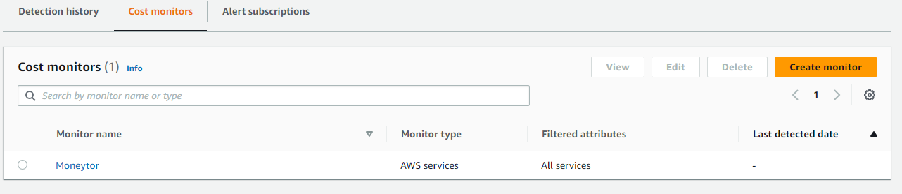

# AWS Pricing
Hoeveel gaat CAPEX-OPEX je opleveren? Hierbij geeft AWS meerdere handvatten om je OPEX per GB per maand lager te krijgen. 

## Key-terms
  
**S3**  
Amazon S3 is een dienst waarmee je objecten kunt opslaan. Het staat voor Amazon Simple Storage Service. Het is alsof je een enorme digitale opslagruimte hebt waar je bestanden kunt bewaren. Het is heel betrouwbaar, zodat je altijd toegang hebt tot je gegevens. Bovendien zorgt Amazon S3 ervoor dat je bestanden veilig zijn en dat ze snel kunnen worden opgehaald wanneer je ze nodig hebt.  
**EC2**  
Op basis van een vertaling van pagina 1 van de User Guide over EC2 kan men het volgende daarover zeggen. Zie voor de meerbedoelde User Guide het kopje "Gebruikte bronnen". Amazon Elastic Compute Cloud (Amazon EC2) biedt op aanvraag schaalbare rekenkracht in de Amazon Web Services (AWS) Cloud. Met Amazon EC2 kun je hardwarekosten verminderen, zodat je sneller applicaties kunt ontwikkelen en implementeren. Je kunt Amazon EC2 gebruiken om zoveel of zo weinig virtuele servers te starten als je nodig hebt, beveiliging en netwerken configureren, en opslag beheren. Je kunt capaciteit toevoegen (opschalen) om rekenintensieve taken aan te kunnen, zoals maandelijkse of jaarlijkse processen, of pieken in websiteverkeer. Wanneer het gebruik afneemt, kun je de capaciteit verminderen (terugschalen).  
**Always free services**
Per 26.06/2023 zijn er 29 services in AWS die altijd gratis zijn. Zie deze [site](https://aws.amazon.com/pricing/)  om al deze services te zien. Vink daarbij in de filter, die wat meer onderaan de webpagina staat, "Always Free" aan. 

## Opdracht
### Gebruikte bronnen
[User Guide Amazon EC2](https://docs.aws.amazon.com/pdfs/AWSEC2/latest/WindowsGuide/ec2-wg.pdf#concepts)
### Ervaren problemen

### Resultaat
1. Een capture van de monitor die ingesteld is ziet men hieronder:  
   
2. Er is binnen AWS een "AWS cost Management" omgeving allereerst. Daarin kunnen tools worden gevonden om kosten te monitoren. Een voorbeeld van zo'n tool is de "Cost Explorer". 

