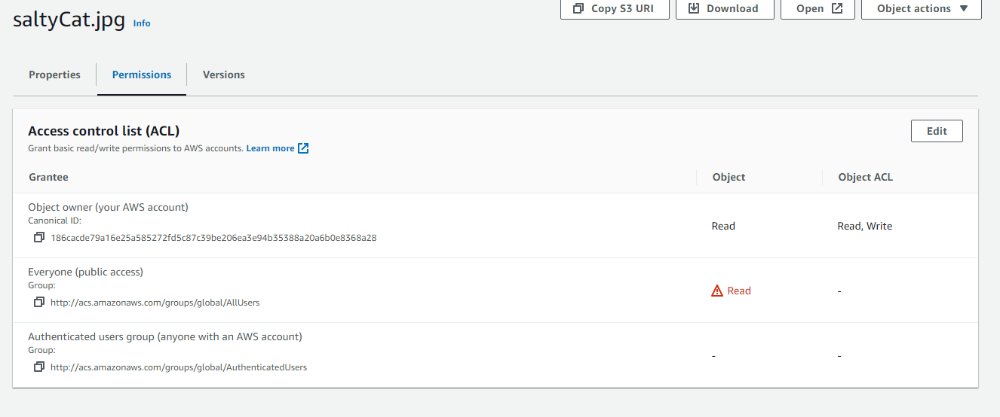
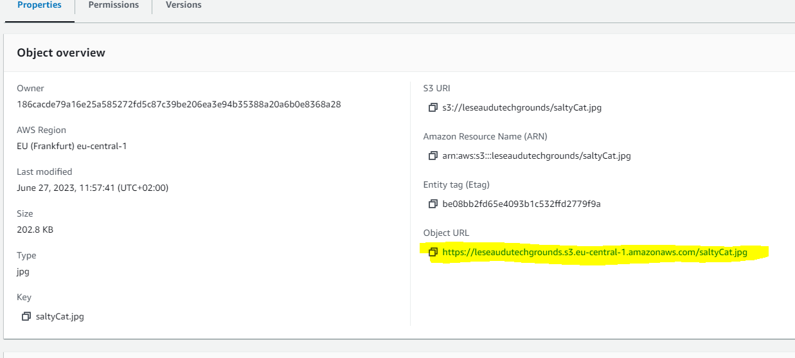
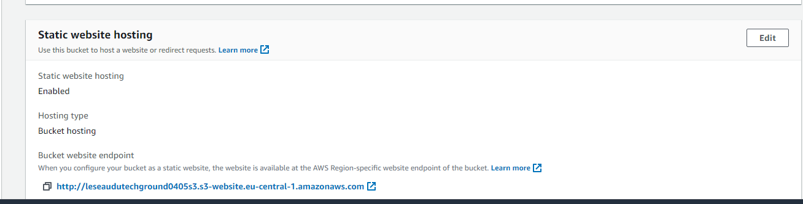

# Simple Storage Service (S3)
Geef een korte beschrijving van het onderwerp

## Key-terms
**bucket**:
**object**:
**permissions**:

## Opdracht
### Gebruikte bronnen

### Ervaren problemen
Enigzins nerveus van alle meldingen van AWS over het feit dat mijn bucket voor eenieder te zien was. 

### Resultaat
1. Allereerst moest ik ervoor zorgen dat files in de nieuwe bucket überhaupt door derden gezien konden worden. Hiervoor ben ik naar de permissions van de bucket gegaan en heb ik ervoor gekozen om "Block all public access" uit te vinken. Vervolgens ben ik in mijn bucket genavigeerd naar het object i.c. De permissions heb ik zo ingesteld dat eenieder een URL van het object kan zien. Na mijn aanpassingen zagen de permissions van het plaatje van de kat er als volgt uit:  
.  
Via de Properties van het object i.c. heb ik de URL van het object gevonden. Dat kan men in het volgende plaatje terugzien: 
  
Hoe het ook zij, het plaatje is voor eenieder te bekijken via deze [link](https://leseaudutechgrounds.s3.eu-central-1.amazonaws.com/saltyCat.jpg).
2. In deze opdracht dien je je bucket een statische website te laten hosten. ALs je naar de properties van de bucket gaat, kun je dat daar instellen en je kunt daar ook de website endpoint aantreffen. Voor de duidelijk een knipsel van die situatie:  
  
In ieder geval is de statische website te bezoeken via deze [link](http://leseaudutechground0405s3.s3-website.eu-central-1.amazonaws.com)

