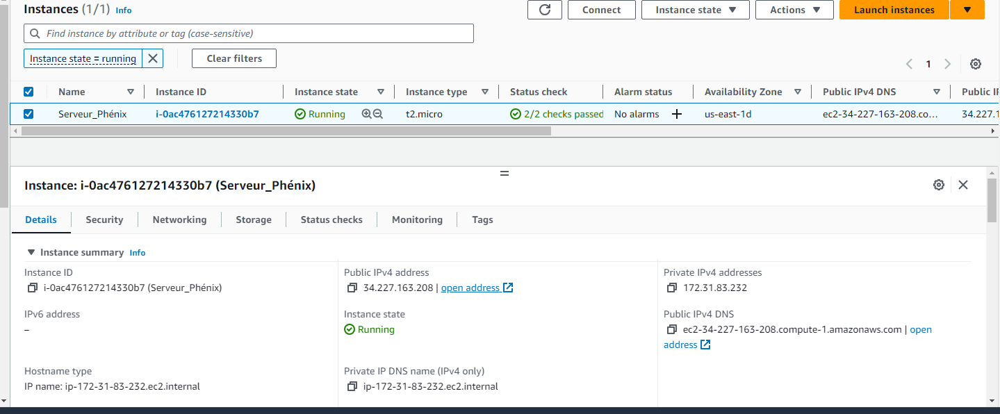
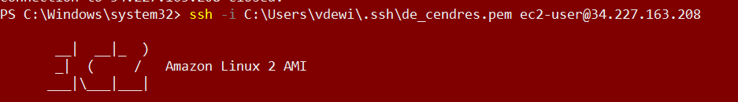
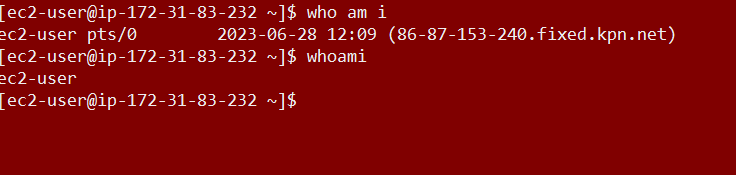
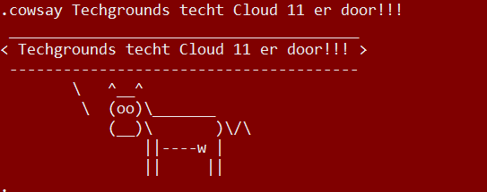
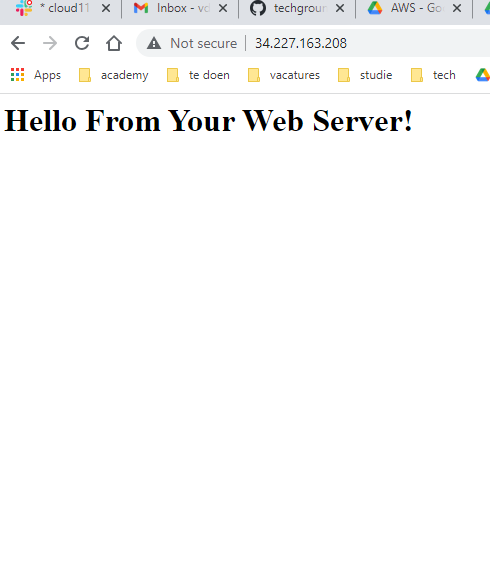

# Elastic Compute Cloud
EC2 (Elastic Compute Cloud) is de virtuele serverdienst van Amazon Web Services (AWS). Het stelt gebruikers in staat om schaalbare virtuele machines (instances) te maken en te beheren in de cloud. Met EC2 kun je flexibel computercapaciteit op aanvraag inzetten, zodat je snel resources kunt toevoegen of verminderen naar behoefte. EC2 biedt een brede selectie van instance typen, besturingssystemen en configuratie-opties, waardoor het geschikt is voor diverse workloads, zoals webapplicaties, databases, machine learning en meer.

## Key-terms
**VM**: Virtual Machine run in the cloud.     
**SSH**: Secure Shell protocol. protocol to connect to Linux machines.   
**RDP**: Remote Desktop Protocol. Protocol to connect to Windows machines.  
**instance**: Een instance in AWS is een virtuele server die wordt gehost op de infrastructuur van Amazon Web Services.  
**AMI**: Amazon Machine Image. Dit is een blauwdruk voor je machine. Het bevat een sjabloon voor bijvoorbeeld het Operatie-Systeem.  
**ephemeral**: kortstondig.  
**stateful Firewall**: Een stateful firewall is een firewall die netwerkverkeer filtert op basis van de context en toestandsinformatie van eerdere pakketten, waardoor het de volledige communicatiestroom kan volgen en beheren. The Security group of an instance in EC2 is een stateful firewall.  
**stateless Firewall**:  Een stateless firewall is een firewall die netwerkverkeer filtert op basis van individuele pakketten zonder rekening te houden met de context of de toestandsinformatie van eerdere pakketten.  
**elastisch IP-adres**: Dit is een statisch openbaar IPv4-adres dat kan worden toegewezen aan een instance van AWS. 
## Opdracht
### Gebruikte bronnen
[Website met info over de users waarmee je kan inloggen](https://stackoverflow.com/questions/20779454/how-to-find-the-username-of-the-instance-launched-in-amazon-ec2)  
[User guide voor Linux instances](https://docs.aws.amazon.com/AWSEC2/latest/UserGuide/AccessingInstancesLinux.html) 


### Ervaren problemen
Bij de eerste instance die ik runde had geen geen private key gegenereerd in de vorm van een pem-file. Hierdoor kon ik niet veilig inloggen. Ik heb toen mijn instance getermineerd en toen een nieuwe instance aangemaakt waarbij ik wél een pem-file had laten genereren. 

### Resultaat  
Door middel van de instructies in het docx-bestand is het gelukt een instance op te zetten. Daarbij heb ik een pem-bestand laten maken die ik op mijn lokale machine heb opgeslagen. Dit bestand heet de_cendres.pem. Bij mijn EC2-dashboard zag ik het volgende:  
 
Uit het voorgaande plaatje blijkt dat de server genaamd 'Serveur_Phénix' klaar is om gebruikt te worden. Tijd dus om te pogen in te loggen daarop.  
Ik heb om dat te bewerkstelligen Microsoft Powershell gebruikt. Via:
```
ssh -i C:\Users\vdewi\.ssh\de_cendres.pem  root@34.227.163.208

```
 Toen ik krijg ik de output van het systeem dat ik niet met root kon inloggen, maar dat dat wel zou gaan met ec2-user. Dit heb ik dan ook gedaan. Mijn input was als volgt: 

 ```
 ssh -i C:\Users\vdewi\.ssh\de_cendres.pem  ec2-user@34.227.163.208
 
 ```
Deze input gaf mij het volgende resultaat: 
  

Het leek gelukt ingelogd te zijn. Evengoed wildeik de proef op de som nemen. Ik besloot wat input aan de shell te geven. Toen zag ik het volgende:  
  
Daarna heb ik een ogenblik genomen om even de komische kanten van linux te ontdekken. Dat kan men hieronder zien:  
  
Gezien het feit dat ik meteen wat updates had geïnstalleerd na mijn initiële login, kon ik ook meteen in de browser mijn instance bezoeken. Toen ik via Google Chrome naar het publieke IP-adres navigeerde, zag ik het volgende:  
 