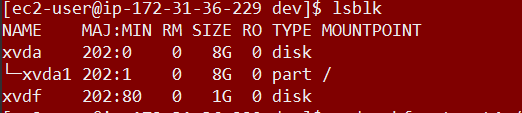

# Elastic Block Store (EBS)
EBS (Elastic Block Store) is een opslagdienst van Amazon Web Services (AWS) die blokgebaseerde opslagvolumes biedt voor gebruik met EC2-instances. Met EBS kunnen gebruikers persistent gegevens opslaan en koppelen aan hun EC2-instances. Het biedt hoge betrouwbaarheid en prestaties met de mogelijkheid om op verzoek schaalbare opslagvolumes te creëren en aan te passen aan de behoeften van de applicatie. EBS-volumes kunnen worden gebruikt als opstartvolumes voor EC2-instances, om gegevens op te slaan voor databases of om gegevens over te dragen tussen verschillende EC2-instances. EBS ondersteunt functies zoals snapshotting, encryptie en het creëren van geoptimaliseerde volumes voor hogere prestaties.

## Key-terms 
**root volumes**: Dit zal een interne harde schijf op een lokale machine moeten zijn.  
**seperate volume**: Dit zal bijvoorbeeld een externe hard schijf zijn. NB Volumes kunnen opgeschaald worden in AWS, maar ze kunnen niet afgeschaald worden.  
**snapshots**: Snapshots in AWS zijn momentopnames van EBS-volumes die worden gebruikt voor back-ups, herstelpunten en het delen van gegevens.


## Opdracht
### Gebruikte bronnen


### Ervaren problemen
In het begin was het onduidelijk voor mij waar ik precies een EBS moet opstarten. 


### Resultaat 
Allereerst heb ik voor deze opdracht een instance en een EBS-volume moeten creëren. Ik zal daarvan hieronder was knipsels laten zien: 
  
  
Merk daarbij op dat ik ervoor heb gezorgd dat de instance en het EBS-volume in dezelfde Availibility Zone resideren, namelijk de eu-central-1b Availibity Zone. 
Hierna heb ik het volume gekoppeld aan de instance. Dat heb ik gedaan door te klikken op "Actions" en daarna op "Attach volume". Nadat ik dit had voltooid, checkte ik bij mijn instance of het EBS-volume daadwerkelijk gekoppeld was. Door middel van het Storage overzicht kon ik dit doen. Ter illusttatie volgt nu een knipsel: 
   
Duidelijk is te zien, zelfs aangegeven in een groen lettertype, dat het EBS-volume "Attached is". 

Om de opdracht verder uit te voeren connecteren we nu met de Linux instance. Ikzelf doe dat via Microsoft powershell. Bij het creëren van mijn instance heb ik ervoor gekozen dit te kunnen doen via SSH. Dit lukt, getuige het volgende:
  
Nu is het tijd om het EBS-volume te mounten op mijn instance. Daarvoor maak ik eerst een directory aan genaamd Verbreding. Aan deze directory zal ik uiteindelijk het EBS-volume mounten. Nu zal ik mijn device moeten vinden in de Linux-omgeving. Via: 
```
lsblk
```
kan ik alle beschikbare disks zien. Door het gebruik van die input zie ik het volgende: 
  
Uit het voorgaande kunnen we opmaken dat er een beschikbare disk is genaamd xvdf met een grootte van 1GiB. Dit is de disk die ik in de AWS-console gekoppeld heb. 

Het daadwerkelijke mounten doe ik met de volgende input: 
```
$ sudo mount /dev/xvdf /home/ec2-user/Verbreding 
```

Hierdoor wordt het volume gemountd aan de directory "Verbreding". 
Als we nu weer de command "lsblk" gebruiken zullen we hopelijk zien dat de laatsgenoemde directory als mountpoint staat geregistreerd. We zien het volgende:  
                          

Warempel, xvdf is daadwerkelijk gemound en wel op het mountpoint /home/ec2-user/Verbreding. Nu kunnen we de exercise 2 afronden door in de directory Verbreding een textfile te maken. dat doen we door de volgende input: 
```
sudo nano /home/ec2-user/Verbreding/ThisFileResidesOnAMountedDevice.txt

```

Om AWS-07 EBS af te sluiten zal ik nu Exercise 3 uitvoeren. Via de AWS-console kan ik een snapshot van mijn EBS-volume maken. In de AWS-omgeving kan ik deze terugvinden bij Snapshots. Een knipsel van wat ik zie aldaar: 
  

Hierna is het tijd om mijn tekstbestand te verwijderen. Hieronder zien we dat dat daadwerkelijk gebeurd is: 
       
Nu is het tijd om een nieuw EBS-volume te creëren door gebruik te maken van de snapshot die net gecreëerd is. Dat kan weer via de AWS-console. Daar selecteer ik de snapshot die we nodig hebben en laat ik AWS er een volume van maken. Als ik daarna bij het overzicht van mijn volumes kijk, zie ik dat er inderdaad een volume is bijgekomen. Nu ga ik mijn eerste volume detachen en het nieuwe volume atachen aan mijn instance. ik kies ervoor dit nieuwe device sdj te noemen. Kijken we nu in de Kernel dan zien we inderdaad dit nieuwe device verschijnen:  
  
Nu is het tijd om te zien of te zien of we het tekstbestandje wat eerder verwijderd is nu weer kunnen vinden als we het volume xvdj gaan mounten.
Voor de duidelijkheid creëer ik een nieuwe directory waaraan ik het volume aan zal mounten genaamd Horizon. Voor het mounten gebruik ik de volgende input: 
```
$ sudo mount /dev/xvdj /home/ec2-user/Horizon 
```
Via de command lsblk zie ik dat het volume succesvol gekoppeld is: 
  
En als ik kijk naar de inhoud van de map Horizon zie ik inderdaad weer het bestand dat we aan het begin van Exercise 3 hebben verwijderd:  
  


