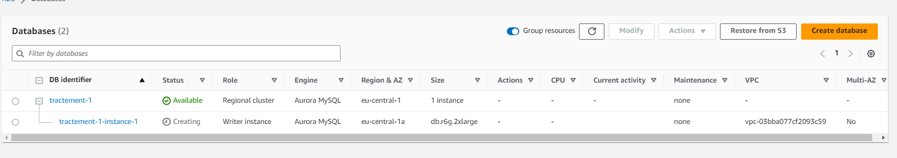

# RDS & Aurora
Het volgende is belangrijk om te onderstrepen. Aurora is eigenlijk een variant van RDS (Relational Database Service) binnen AWS. Het is een specifiek type relationele database-engine dat is ontworpen om compatibiliteit te bieden met MySQL- en PostgreSQL-databases, terwijl het verbeterde prestaties en schaalbaarheid biedt. 

NB Aurora’s I/O-Optimized  is een nieuwe cluster-opslagconfiguratie die voorspelbare prijzen biedt voor alle toepassingen en verbeterde prijs-prestatieverhouding, met tot wel 40% kostenbesparing voor I/O-intensieve toepassingen.
## Key-terms
**RDS**: Deze afkorting staat voor "Relational Database Service".
**DB**: Deze afkorting staat voor database doorgaans. 

## Opdracht
### Gebruikte bronnen
[User Guide RDS]

### Ervaren problemen
Het was listig meteen te begrijpen hoe Aurora zich verhoudt met AWS RDS. Toen ik daadwerkelijk met het creëren van een DB aan de slag ging, ging ik het concept Aurora beter begrijpen. Dit kwam omdat ik Aurora nu kon kiezen als een engine voor mijn database die ik maakte om mee te oefenen. 

### Resultaat
Allereerst begonnen met het creëren van een DB. Daarbij heb ik gekozen voor een Aurora engine, aangezien we in deze opdracht ook met Aurora dienen te werken. Hieronder een screenshot van het geheel:   

