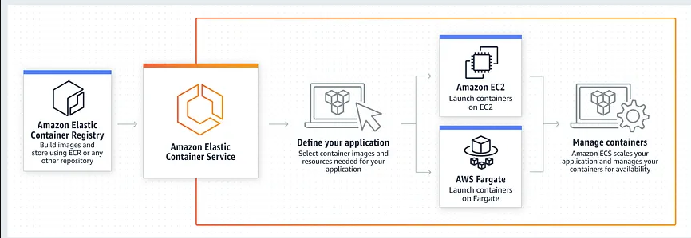

# ECS
Laten we meteen met de hamvraag beginnen: wat is ECS exact? Amazon ECS staat Amazon Elastic Container Service. Het is een container-symbiose die volledig gemanaged is en die je helpt makkelijk "containerized" applicaties uit te zetten, te managen en op of af te schalen. In ECS zijn zowel AWS-applicaties als applicaties van derden geïntegreerd.Je kunt daarnaast je container-workloads uitvoeren en schalen over Regions en "on-premises", zonder de complexiteit van het beheren van een control plane. Hoe kun je deze service het beste gebruiken? Hier volgen een aantal use cases van ECS. Je kan door middel van ECS opeenvolgende workloads en/of meerdere workloads tegelijk laten draaien op AWS Batch. Verder kun je via ECS web applications bouwen die automatisch op- en afschalen. Deze meerbedoelde applicaties draaien in een zeer goed beschikbare configuratie op meerdere AZ's. Daarbij worden automatisch gebruik gemaakt van AWS-services, zoals een ALB en een VPC. ter illustratie: 
 
## Key-terms
**AWS Batch**: AWS Batch maakt het mogelijk om eenvoudig en efficiënt batch computing workloads van elke omvang uit te voeren op AWS met behulp van Amazon EC2 en Amazon EC2 Spot.  
**APC**: Application Load Balancer  
**VPC**: Virtual Private Cloud  
**container**: Een container is een standaardeenheid van software die de toepassingscode en alle relevante afhankelijkheden bevat. In het Engels voor de duidelijkheid: A container is a standard unit of software that contains application code and all relevant dependencies. 
**container-service**: Met deze service kun je dus beschikken over je containers. 

## Opdracht
### Gebruikte bronnen
[startpagina-ECS AWS-console](https://eu-central-1.console.aws.amazon.com/ecs/v2/getStarted?region=eu-central-1)  
[Developer_Guide ECS](https://docs.aws.amazon.com/AmazonECS/latest/developerguide/Welcome.html)  
[Website over werking ECS](https://nupmanyu.medium.com/amazon-elastic-container-service-4891d7b286a3)

### Ervaren problemen
Wist niet van tevoren al wat binnen AWS de definitie van een container exact was. 

### Resultaat
Dit is een studeeropdracht. Resultaten zijn hier niet terug te zien zodoende. 
