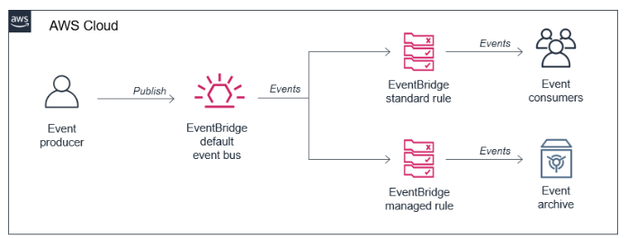
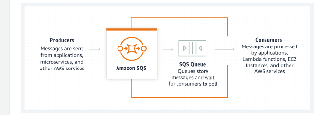
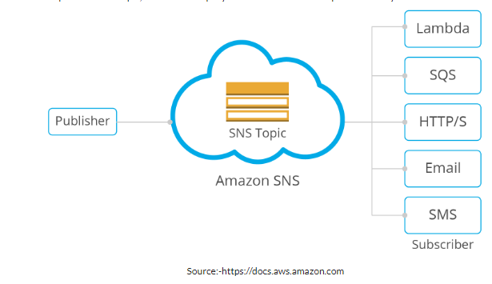

# SNS, SQS, EventBridge
In dit verslag zullen meerdere services de revue passeren: SNS, SQS en EventBridge. We beginnen met deze laatste service.  

Amazon EventBridge is een serverloze service die "events" gebruikt om applicatiecomponenten met elkaar te verbinden, waardoor het voor ontwikkelaars gemakkelijker wordt om schaalbare "event-driven" applicaties te bouwen. Events kunnen voortkomen uit je eigen applicaties, SaaS-applicaties en AWS services. Deze events kunnen dan worden verzonden naar een andere service om gebruikt te worden. Denk hierbij bijvoorbeeld aan een service als AWS lambda. Voor het begrip dient men te weten dat EventBridge in principe een traditionele "Event Bus" is. Om een en ander te visualiseren zal hieronder een diagram volgen.  

Komen we nu bij AWS SQS. Deze afkorting staat voor Simple Queue Service. Het werkt als volgt. "Producers" sturen berichten naar de "SQS queue. Producers kunnen applicaties zijn, microservices en alle AWS-services. De SQS-queue slaat de berichten op. De berichten kunnen vervolgens worden verwerkt door "consumers", als ze daar klaar voor zijn. Consumers kunnen applicaties zijn of verschillende AWS-services. Het volgende plaatje uit de console kan helpen om het concept snel te begrijpen: 

Ter illustratie een use case: NASA gebruikt de SQS-service bijvoorbeeld om inkomende ""jobs" van pipeline processen te ontkoppelen. 

Tot slot bespreken we in de verslag nog SNS. Deze drie letters staan voor Simple Notification Service. Deze service zorgt ervoor dat "serverless event-driven"applicaties, microservices gedistribueerde systemen kunnen communiceren zonder dat ze gekoppeld hoeven te worden. Ze blijven dus "decoupled". SNS werkt met publishers en subscribers. publishers communiceren met deze subscribers via "Topics". Dit is een "logical access point" en "communication channel". Subscribers kunnen via zo'n topic berichten krijgen via het door hen zelf gekozen platform. Het volgende plaatje zal hopelijk helpen deze dienst goed te begrijpen: 

Ter illustratie weer de use case van NASA: zij gebruikt de SNS-service om het pipeline proces op gang te brengen als er nieuwe content wordt geüpload. 

## Key-terms
**SaaS**: "Software as a Service"  
**ABAC**: "Attribute-Based Access Control"

## Opdracht
### Gebruikte bronnen
[Developer Guide SQS](https://docs.aws.amazon.com/AWSSimpleQueueService/latest/SQSDeveloperGuide/welcome.html)  
[Developer Guide SNS](https://docs.aws.amazon.com/sns/latest/dg/welcome.html)  
[Website over EventBridge](https://www.trek10.com/blog/amazon-eventbridge)  
[Blog ihkv EventBridge](https://aws.amazon.com/blogs/compute/archiving-and-replaying-events-with-amazon-eventbridge/)

### Ervaren problemen
Het concept dat SQS een heel proces heeft voor input van applicaties waar het niet compatibel mee is, had ik niet meteen door. Dit zorgde voor wat vertraging. 

### Resultaat
De beschreven diensten zijn "gewoon" via de zoekbalk van de Console te vinden. Aanzetten van de diensten gaat verder op de voor AWS gebruikelijke wijze. Gezien het feit dat bij deze diensten het koppelen van diensten aan elkaar  of een efficiënte wijze juist dé service is, lijkt het mij een overbodige vraag hoe je deze service kan koppelen aan andere services. 

